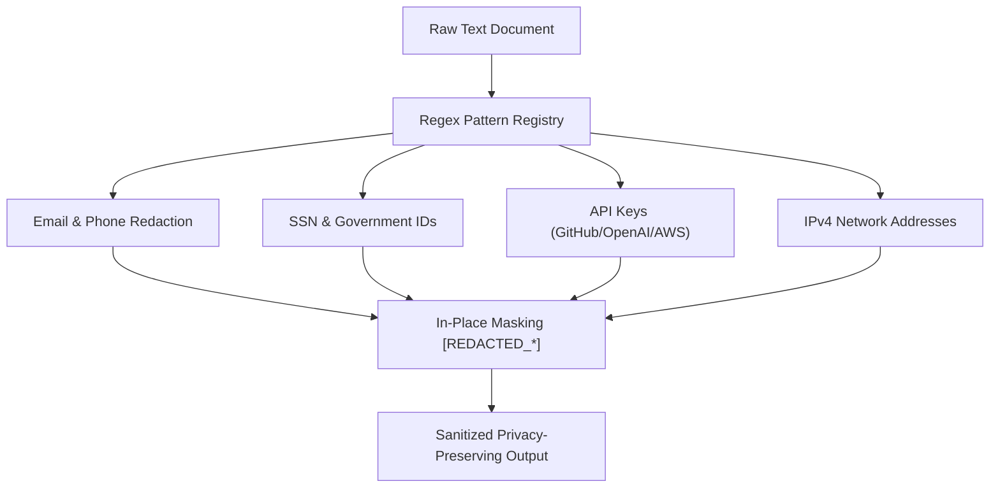

# genpark-pii-anonymizer-credential-scrubber-skill

Agent Skill implementing **PII and API Credential Redaction & Privacy Guardrails** in 100% Python standard library.

## Architectural Flow

```mermaid
flowchart TD
    Raw["Raw Text Document"] --> Engine["Regex Pattern Registry"]
    Engine --> PII1["Email & Phone Redaction"]
    Engine --> PII2["SSN & Government IDs"]
    Engine --> PII3["API Keys (GitHub/OpenAI/AWS)"]
    Engine --> PII4["IPv4 Network Addresses"]
    PII1 & PII2 & PII3 & PII4 --> Redact["In-Place Masking [REDACTED_*]"]
    Redact --> Safe["Sanitized Privacy-Preserving Output"]
```
